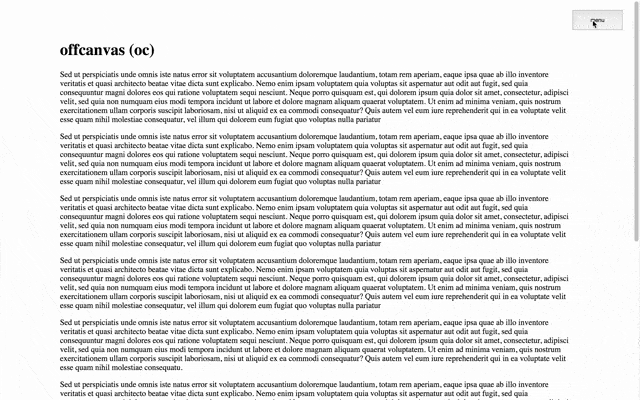

## offcanvas.js
Yet another offcanvas solution...

1. requires Jquery, TweenMax.
2. manually tested to work on latest version of Chrome, Firefox, Safari and IE.


## Demo


Demo link at http://htmlpreview.github.io/?https://github.com/simboonlong/offcanvas.js/blob/master/index.html


## But why?

There are many offcanvas plugins out there, but I need a plugin that tackles mainly these issues:

1. Basic responsiveness + works in mobile.
2. Position fixed elements within transformed offcanvas element.
3. Preferably, both content and menu remains scrollable when in active state.
4. Minimal code.


## Here's how

1. Breakpoints based on Bootstrap 3.3.* used.
2. Can't defy this. Apply `.oc-slide` class to slide the fixed element as well.
3. Uses native scrollbar. Nothing fancy. `-webkit-overflow-scrolling: touch` for menu in mobile.
4. Tried to, but not without prerequisites: jQuery + TweenMax.


## Usage

Follow the structure in index.html. Import the css styles, otherwise scss version is available too. Notice that offcanvas.js is written loosely. Please feel free to modify to your needs.

Basic options in offcanvas.js are:

```
var offcanvas = new OffCanvas({
    throttleThreshold : 50, // control window resize throttle, updates menu trigger's position
    slideDuration : 0.7, // sliding time (TweenMax)
    slideEase : 'Expo.easeOut' // sliding ease type (TweenMax)
});

```

To change left/right direction of the offcanvas slide:

1. Apply `.oc-menu-trigger-left` or `.oc-menu-trigger-right` class to `#oc-menu-trigger` element in the html.
2. Apply `.oc-menu-left` or `.oc-menu-right` class to `#oc-menu` element in the html.


## License
offcanvas.js is licensed under the MIT license. (http://opensource.org/licenses/MIT)


## Contributing
Feel free to contribute.